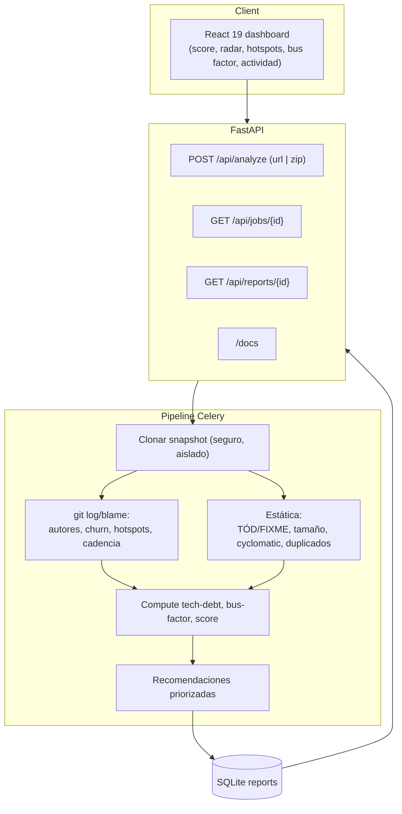

# TechDebt Radar — Analítica de salud técnica de repositorios (deuda técnica + bus factor)

> **Proyecto propuesto · Portafolio · Luis Patricio Flores Álvarez**
> **Estado:** Propuesto (documento de planificación y diseño)
> **Fecha:** Agosto 2026

---

## 1. Resumen ejecutivo

**TechDebt Radar** es una herramienta web que, al pegar una URL de un repositorio (GitHub), **analiza su historial de Git y su código actual** y produce un **dashboard de salud técnica** con métricas accionables: **tech debt** (código duplicado, TODOs, archivos grandes, complejidad), **hotspots** (archivos que concentran cambios), **bus factor** (riesgo de que alguien irremplazable se vaya), **churn** (inestabilidad de archivos) y **deuda estimada en esfuerzo**. Todo con visualizaciones interactivas (Chart.js) y recomendaciones priorizadas.

Es el más analítico/visual de los tres y el **demo más inmediato**: pega un repo público y en <30 s tienes un reporte. Menos parsing de código, más **ingeniería de datos sobre Git**.

### Por qué para un dev-reclutador
- **Visual y memorable**: los dashboards de salud de repo son raros y llaman la atención; hablan de "arquitectura y mantenimiento", no de CRUD.
- **Demo muy barata**: basta un repo, sin LLM ni claves ni infra pesada → demo robusta.
- Demuestra **ingeniería de datos**: lectura de `.git` (log, commits, autores), cálculo de métricas y visualizaciones.
- Complementa tu perfil de "arquitecto que también **sabe medir y mantener**" (un valor que los tech leads y seniors aprecian de verdad).

---

## 2. Necesidad y problema que resuelve

**Problema:** decidir dónde invertir mantenimiento es difícil sin datos. Métricas como "¿qué archivo cambia constantemente y nadie lo toca?", "¿cuánta deuda técnica tengo?", "¿qué pasa si X se va?" no salen de un vistazo, y las herramientas de pago son caras y cerradas.

TechDebt Radar aporta:
1. **Métricas objetivas** sobre historial y árbol de código (no opiniones).
2. **Priorización** ("empieza por estos 3 archivos").
3. **Reducción del riesgo de bus factor** (¿depende tu repo de una persona?).
4. Historial/trend si se re-analiza el repo (para mostrar mejora).

### Diferenciación
- Combina **análisis del historial (git log/blame)** + **estática del código (tamaño, duplicados, TÓD, complejidad)** en un **indicador compuesto de salud**.
- Coherente con tu CV: "optimización de procesos, transformación digital, arquitectura".

---

## 3. Objetivos

### Objetivo general
Construir un analizador web público y *self-hosted* de la mantenibilidad de repositorios, con dashboard interactivo, métricas y modo demo funcional.

### Objetivos específicos (MVP)
1. Introducir un repo por **URL de GitHub público** (o ZIP) y clonarlo.
2. **Análisis asíncrono** en background (Celery) del historial de Git + el árbol de código.
3. **Métricas**:
   - **Hotspots**: archivos con mayor número de cambios/churn.
   - **Bus factor**: distribución de autores por archivo.
   - **Tech debt**: TODOs/FIXMEs, archivos muy largos o muy complejos, duplicados simples.
   - **Churn/inestabilidad** mapeada por ruta.
   - **Cadencia de commits** (actividad temporal).
   - **Score de salud global** (0–100) propio.
4. **Recomendaciones** priorizadas ("dado que X cambia mucho, añade tests").
5. **UI dashboard** con Chart.js (radar, heatmaps por ruta, líneas de actividad).
6. **Modo demo embebido** con repos ya analizados.

### No objetivos MVP
- GitLab/Bitbucket (posible en F4).
- Integración con PRs/JIRA (coste) — futuro.
- Multi-repo con score por equipo — futuro.

---

## 4. Stack tecnológico propuesto

### 4.1 Backend

| Componente | Decisión | Motivación |
|-----------|----------|-----------|
| Lenguaje | **Python 3.14 (FastAPI)** | Coherente; parseo de git con `gitpython` sencillo. |
| Git | **GitPython** + `git log` CLI batch | Lectura de historia, autores, blame por archivo. |
| Análisis estático | **Radon** (Python, cyclomatic) + heurísticos básicos para TS/JS | Suficiente para MVP sin tree-sitter. |
| Análisis de duplicados | Simple: líneas repetidas / archivos homogéneos | Ligero, defendible para MVP. |
| Cola de tareas | **Celery + Redis** | Análisis en background. |
| Storage | **SQLite** (reportes por run) | Ligero; v2 → Postgres. |
| Orquestación | **Docker + Docker Compose** | Self-host. |

### 4.2 Frontend
- **React 19 + TypeScript 5 + Vite**.
- **Chart.js** (radar de métricas, heat streaks, líneas de actividad).
- Secciones del dashboard: **Score**, **Hotspots**, **Tech Debt**, **Bus Factor**, **Actividad**.
- **Vitest** para tests.

### 4.3 Infra / observabilidad / deploy
- Docker multi-stage + docker-compose (web + worker + redis).
- GitHub Actions: lint/test/build/deploy.
- `/health` y `/health/ready`; persistencia SQLite en volumen.
- **Render Free** (web + worker + Redis) o **OCI**.

---

## 5. Arquitectura (flujo)



**Flujo de un análisis**
1. `POST /api/analyze` con URL de repo → crea Job(pending) → worker.
2. Worker: **clona snapshot** (directorio aislado, límite de tamaño, timeout).
3. Extrae con `git log --numstat` los cambios por autor y por archivo; calcula **hotspots**, **churn**, **bus factor**.
4. Escanea estática (TÓD/FIXME, tamaños, duplicados, complejidad) y acumula por ruta.
5. Compone el **score** y las **recomendaciones**.
6. La UI refleja el reporte con widgets.

### Carpetas

```
techdebt-radar/
├── backend/
│   ├── app/
│   │   ├── api/        # analyze, jobs, reports, health
│   │   ├── core/       # config, settings
│   │   ├── clone/      # clonado seguro + límites
│   │   ├── gitana/     # git-log → hotspots, churn, bus-factor
│   │   ├── static/     # TÓD, tamaño, duplicados, cyclomatic
│   │   ├── scoring/    # score + recomendaciones
│   │   └── db/
│   ├── workers/
│   ├── tests/
│   └── Dockerfile
├── frontend/
│   ├── src/            # widgets del dashboard
│   ├── tests/
│   └── Dockerfile / nginx
├── docker-compose.yml
├── .github/workflows/ci.yml
└── README.md
```

---

## 6. Métricas en detalle (MVP)

| Métrica | Fuente | Muestra |
|---------|--------|---------|
| **Hotspots** | `git log --numstat` por archivo | archivos con más cambios / churn (priorizados). |
| **Churn** | líneas añadidas/borradas por archivo | inestabilidad por ruta (heatmap). |
| **Bus factor** | distribución de autores por archivo | "¿este módulo depende de 1 dev?" (semáforo). |
| **Tech debt** | FIXMEs/TÓD + código muy largo + duplicados + complejidad | inventario de "por dónde empezar a pagar". |
| **Cadencia** | commits por día/semana | salud del equipo (línea/streak). |
| **Score de salud** | compuesto propio 0–100 | radar para comparar con otro repo. |
| **Recomendaciones** | reglas sobre las métricas | "El archivo X cambió 90 veces en 2 meses; añade tests". |
---

## 7. Documentación

### 7.1 README
- Badges: **build/coverage/deploy/license + "Try demo"**.
- **Demo GIF** del dashboard (2 visuales clave).
- Quickstart (compose) + credenciales demo.
- Arquitectura mermaid.
- Comandos de test.

### 7.2 Docs del repo
- `docs/arquitectura.md` + **ADRs**: métricas propias vs CodeClimate, sesgos del algoritmo de score, uso de GitPython/blame.
- `docs/seguridad.md`.
- `docs/demo.md`.

### 7.3 Write-up asociado
> "Ciencia de datos sobre Git: cómo medir el bus factor, los hotspots y el riesgo de mantenimiento de un repo (y por qué la deuda técnica no es solo cantidad de TODOs)". — Propuesto.

---

## 8. Seguridad

Menos crítico que RepoBrain (no ejecuta código), pero acepta repos de terceros (clones) y debe protegerse.

| Amenaza | Mitigación |
|---|---|
| Ejecución de código del repo | **Nunca se ejecuta el código**: solo `git log`/`blame` y análisis estático en texto. Clonado en directorio **aislado** y limpiado. |
| SSRF al clonar URL | Solo `https://github.com/...` validado; **bloqueo de IPs privadas**; timeout; límite de tamaño/archivos. |
| Zip-bomb / repo gigante | Límites de tamaño, número de commits/archivos, timeout, clon *shallow* (`--depth`). |
| Path traversal | Todo el análisis **bajo la raíz del repo** (`resolve().startswith(raiz)`); nunca leer fuera. |
| XSS en dashboard/visores | React escapa; **CSP estricta**; sin `dangerouslySetInnerHTML` con datos de repo. |
| DoS (disparos masivos) | **Rate limiting** en `/api/analyze`, límite de tamaño, cancel de jobs. |
| Secretos en el repo | Enmascarado o `gitleaks` opcional en la UI. |
| Dependencias | `pip-audit` / `npm audit` + SBOM en CI. |

---

## 9. Modo demo (sin fricción)

- **Repos de ejemplo (2–3) pre-analizados**, entre ellos **SCEPUBLICO** y/o **ReservaLugar**, semilla embebida para que la UI se abra con reporte.
- **Botón "Analizar repo público"**: pegar URL → pipeline en vivo (el progreso es también un "wow").
- **Sin registro** (guardado local/efímero) y **sin API key** (no usa LLM en el core).
- Si se agregan cuentas: `demo@techdebt.dev` / `Demo!2026` con **reset** de proyectos.

---

## 10. Tests, CI/CD y calidad

### Backend (pytest)
- Unit: extracción de `git log --numstat` (repo *fake* con pocos commits), cálculos de churn/hotspots/bus-factor, TÓD/duplicados, score, recomendaciones.
- API: TestClient con repos *fixture*; Celery en **modo *eager*** (sin servidor real en tests).
- *Smoke* contra un repo conocido (SCEPUBLICO) para validar el score.

### Frontend (Vitest + RTL)
- Componentes del dashboard (gauge, radar, heatmap row, bus factor), navegación de secciones, datos mock.

### CI/CD
- GitHub Actions: lint → pytest → vitest → build → push GHCR → deploy.
- Badges en README.

---

## 11. Despliegue

- **Render Free**: servicio web (front+back, nginx) + worker Celery + Redis.
- **OCI** alternativo.
- `/health` + persistencia SQLite en volumen; HTTPS + dominio.

---

## 12. Planificación y roadmap

| Fase | Entregable | Tareas clave | Est. |
|---|---|---|---|
| **F0** | Esqueleto self-host | FastAPI + React + CI, `/health` | 2–3 d |
| **F1** | Git Analytics MVP | clonado + `git log` → hotspots/churn/bus-factor, API, dashboard | 6–8 d |
| **F2** | Deuda estática + score | TÓD, tamaño, duplicados, complejidad, score, radar | 3–4 d |
| **F3** | Contenido + deploy | README/docs, hardening, CI coverage, deploy, badge, blog | 3–4 d |
| **F4** (opt) | Integración ampliada | GitLab/Bitbucket, trend *over-time*, autenticación | 5–7 d |

**Total MVP (F0–F3): ~14-19 días-persona.**

**Orden:** esqueleto → MVP analytics visuales (F1 rápido) → static+score (F2) → producción (F3). Es el demo más rápido de arrancar de los tres.

---

## 13. Riesgos

| Riesgo | Mitigación |
|---|---|
| Repos grandes tardan | Clon *shallow* y límites; demo con seeds pre-analizadas. |
| Métricas "gravamétricas" (visuales pero poca ingeniería) | Que el **algoritmo de score/bus-factor** sea defendible y documentado (ADR), y alimenta el write-up. |
| Depender de `radon` solo Python | Ampliar estático heurístico a JS/TS (tamaño, duplicados). |
| No se conecta a CI/PR (impacto menor) | Es deliberado en MVP (**standalone analytics**); integración va en F4. |

---

## 14. Conclusión / posicionamiento

TechDebt Radar es el más **visual y rápido de demostrar**: que un reclutador vea en 1 minuto un dashboard con score, hotspots y bus factor de un repo (por ejemplo, tu propio SCEPUBLICO). Es el proyecto **más "data/analytics"** del trío y el que mejor complementa un perfil de arquitecto técnico.

---

## Anexo comparativo de los 3 proyectos

| | **RepoBrain** | **PR-Guardian** | **TechDebt Radar** |
|---|---|---|---|
| Enfoque | Búsqueda semántica + Q&A | AI code review + score seguridad | Analítica de salud de repo |
| Diferencial | "Pregunta a tu código" | Seguridad (+IA) | Visual / data expresiva |
| Demo sin clave | Sí (BM25+embeddings) | Sí (solo reglas) | Sí (sin LLM) |
| Conexión a tu CV | AI/pipelines | **Ciberseguridad** + IA | Arquitectura/mantenimiento |
| WOW rápido | alto | alto | muy alto (visual) |
| Riesgo | medio (parsing) | medio-alto (LLM) | bajo |
| Esfuerzo MVP | ~16-21 d | ~17-22 d | ~14-19 d |

> **Sugerencia global:** usa **RepoBrain** como buque insignia (la más memorable), **PR-Guardian** como la contraparte de seguridad y **TechDebt Radar** como el demo visual de arranque. Si el calendario es ajustado, TechDebt o PR-Guardian son los más rápidos para un primer demo visible.

---

*Documento de planificación — se iterará según feedback y priorización.*